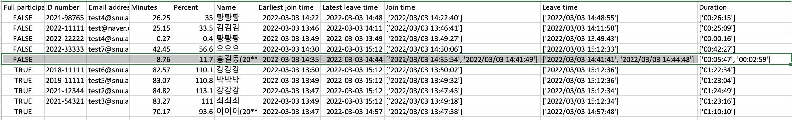

# snuetl-attchk
This is a simple code to be used in terminal to simplify attendance roaster checking for TAs at SNU, S. Korea.

## Installation
1. Install python 3.6+ (tested on 3.9)
    - Install by [Anaconda](https://www.anaconda.com/products/individual)
    - Restard the terminal
    - Make sure that `$ which python` returns something like `/Users/ysbach/opt/anaconda3/bin/python` (i.e., using anaconda's python).
2. Clone this repo (click `code` button)

## Usage
1. **Download the .xlsx file** (ETL -> Classroom -> Zoom session participants list).
2. **Run python code** as described below.

### Basics
```sh
$ python attchk.py inputfile.xlsx [-o output] [-t totalminutes] [-f fullpercent]
```
* `output`: Optional. If not given, saving to CWD, using the same name as input but extension is changed to `.csv`.
* `totalminutes`: Total minutes of the class, time for 100% participation. Default = 75 [min]
* `fullpercent`: Minimum % of time to be regarded as "full participation". Default = 70 [%]

To see the full help manual
```sh
$ python attchk.py -h
```

### Example
Let me explain what is calculated in the code, by looking into an example.

The test input file looks like this:
```
# Input file (``testfile-zoom_participants_93522834467.xlsx`` included in this repo)

ID number	Name	Email address	Join time	Leave time	Duration
2022-11111	김김김	test@naver.com	2022/03/03 13:46:41	2022/03/03 14:11:50	00:25:09
	이이이(20******73)(참여자정보 부족 : ETL 내 일치 수강생 못 찾음)		2022/03/03 13:47:38	2022/03/03 14:57:48	01:10:10
2021-12344	강강강	test2@snu.ac.kr	2022/03/03 13:47:45	2022/03/03 15:12:34	01:24:49
2021-54321	최최최	test3@snu.ac.kr	2022/03/03 13:49:18	2022/03/03 15:12:34	01:23:16
2022-22222	황황황	test4@snu.ac.kr	2022/03/03 13:49:27	2022/03/03 13:49:43	00:00:16
2019-11111	박박박	test5@snu.ac.kr	2022/03/03 13:49:32	2022/03/03 15:12:36	01:23:04
2018-11111	강강강	test6@snu.ac.kr	2022/03/03 13:50:02	2022/03/03 15:12:36	01:22:34
2021-98765	황황황	test4@snu.ac.kr	2022/03/03 14:22:40	2022/03/03 14:48:55	00:26:15
2022-33333	오오오	test7@snu.ac.kr	2022/03/03 14:30:06	2022/03/03 15:12:33	00:42:27
	홍길동(20******62)(참여자정보 부족 : ETL 내 일치 수강생 못 찾음)		2022/03/03 14:35:54	2022/03/03 14:41:41	00:05:47
	홍길동(20******62)(참여자정보 부족 : ETL 내 일치 수강생 못 찾음)		2022/03/03 14:41:49	2022/03/03 14:44:48	00:02:59
```

Running the python code:
```sh
$ python attchk.py testfile-zoom_participants_93522834467.xlsx -t 75 -f 70
```
```sh
# output result printed to terminal
Namespace(input='testfile-zoom_participants_93522834467.xlsx', output=None, totalminutes=75.0, fullpercent=70.0)


 Full? |  ID number |  Minutes   | Percent | Name
================================================================================
 False | 2021-98765 |  26.25 min |  35.0 % | 황황황
 False | 2022-11111 |  25.15 min |  33.5 % | 김김김
 False | 2022-22222 |   0.27 min |   0.4 % | 황황황
 False | 2022-33333 |  42.45 min |  56.6 % | 오오오
 False |     nan    |   8.76 min |  11.7 % | 홍길동(20******62) !!! ETL FAILED !!!
 True  | 2018-11111 |  82.57 min | 110.1 % | 강강강
 True  | 2019-11111 |  83.07 min | 110.8 % | 박박박
 True  | 2021-12344 |  84.82 min | 113.1 % | 강강강
 True  | 2021-54321 |  83.27 min | 111.0 % | 최최최
 True  |     nan    |  70.17 min |  93.6 % | 이이이(20******73) !!! ETL FAILED !!!

	Saved to: /Users/ysbach/test/directory/testfile-zoom_participants_93522834467.csv
```

The columns are calculated by:
```python
totalminutes = args.totalminutes  # 75 in this example
fullpercent = args.fullpercent    # 70 in this example

for each student:
    Minutes = sum("Duration" values from input file)
    Percent = Minutes/totalminutes * 100
    Full_participation = (Percent >= fullpercent)
```

* ``Full? == True`` : Those who participated for more than 70% * 75 minutes.
* ``Full? == False`` : TA may regard them as "absent" or "late" depending on their criteria.
* `!!! ETL FAILED !!!`: For some reason, ETL cannot find who they are (within the ETL system). TAs must check those by themselves.
* The two rows of `황황황` **are not** combined into one, because they're different people (see ID number).
* Same for `강강강`.
* The two rows of `홍길동(20**...)` **are** combined into one, because it's from the same person (from the given information).

### Output File
For debugging purposes, the **output file** contains the full information of "Join time", "Leave time", and "Duration" information, so that the TA can check if there was any unexpected bug/error in the code. This maybe necessary if a student claims about their attendance score...


^ You can see "홍길동" has multiple Join/Leave times, as multiple rows are merged. Earliest/Latest times are also recorded for reference.


## License
BSD-3 (see [LICENSE](LICENSE)), made by Yoonsoo P. Bach in 2022 March, for TA works in "Extraterrestrial Planets and Life" as a 학문후속세대.
