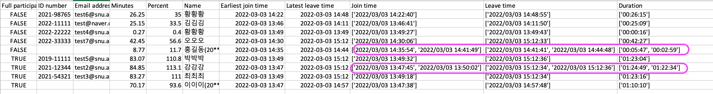

# snuetl-attchk
This is a simple script to simplify attendance roaster checking for TAs of online classes (Zoom) at SNU, S. Korea.


# 1. Installation
Do these **only for the first time**:
1. Install python 3.6+ (tested on 3.9)
    - Install by [Anaconda](https://www.anaconda.com/products/individual)
    - Restard the terminal
    - Make sure that `$ which python` returns something like `/Users/ysbach/opt/anaconda3/bin/python` (i.e., using anaconda's python).
2. Clone this repo (click `code` button)

Do this **regularly**:
1. ``$ git pull``

# 2. Dependence
Tested on MBP 14" [2021, macOS 12.2.1, M1Pro(6P+2E/G16c/N16c/32G)]
* Python 3.9
* pandas 1.4.1
* numpy 1.20.3
* Other modules: ``argparse``, ``os``, ``pathlib``

# 3. Usage
1. **Download the .xlsx file** (ETL -> Classroom -> Zoom session participants list).
    * See the last 2 pages of [this manual](http://etl.snu.ac.kr/local/ubion/manual/contents/ko/manual_f/10.ZoomManage.pdf) (Korean).
2. **Run python code** as described below.
3. Fill the attendance roaster.
4. Get claims from students. :)

## 3-1. Basics
```sh
$ python attchk.py inputfile.xlsx [-o output] [-m minutestotal default=75] [-p percentfull default=70]
```

To see the full help manual:
```sh
$ python attchk.py -h
```

## 3-2. Example
Let me explain what is calculated in the code, by looking into an example.

The test input file looks like this:
```
# Input file (``testfile-zoom_participants_93522834467.xlsx`` included in this repo)

   ID number     Name     Email address        Join time             Leave time     Duration
1  2022-11111    김김김    test@naver.com   2022/03/03 13:46:41  2022/03/03 14:11:50  00:25:09
2     nan     이이이(20******73)  nan       2022/03/03 13:47:38  2022/03/03 14:57:48  01:10:10
3  2021-12344    강강강    test2@snu.ac.kr  2022/03/03 13:47:45  2022/03/03 15:12:34  01:24:49  *
4  2021-54321    최최최    test3@snu.ac.kr  2022/03/03 13:49:18  2022/03/03 15:12:34  01:23:16
5  2022-22222    황황황    test4@snu.ac.kr  2022/03/03 13:49:27  2022/03/03 13:49:43  00:00:16  !
6  2019-11111    박박박    test5@snu.ac.kr  2022/03/03 13:49:32  2022/03/03 15:12:36  01:23:04
7  2021-12344    강강강    test2@snu.ac.kr  2022/03/03 13:50:02  2022/03/03 15:12:36  01:22:34  *
8  2021-98765    황황황    test6@snu.ac.kr  2022/03/03 14:22:40  2022/03/03 14:48:55  00:26:15  !
9  2022-33333    오오오    test7@snu.ac.kr  2022/03/03 14:30:06  2022/03/03 15:12:33  00:42:27
10    nan     홍길동(20******62)  nan       2022/03/03 14:35:54  2022/03/03 14:41:41  00:05:47  +
11    nan     홍길동(20******62)  nan       2022/03/03 14:41:49  2022/03/03 14:44:48  00:02:59  +
```
Note that
1. ``강강강`` (marked by ``*`` at row ``3`` and ``7``) is the _**same person**_ (ID, Name, Email), but Join/Leave time _**overlap**_.
2. ``황황황`` (marked by ``!`` at row ``5`` and ``8``) are _**different people**_ (see ID and Email)
3. ``홍길동`` (marked by ``+`` at the last two rows) is the _**same person**_ (based on all the given information). Join/Leave time do not overlap.

See how they are treated in the final result below.

```sh
$ python attchk.py testfile-zoom_participants_93522834467.xlsx -m 75 -p 70
```
```sh
# output result printed to terminal
 Namespace(input='testfile-zoom_participants_93522834467.xlsx', output=None, minutestotal=75.0, percentfull=70.0)


 Full? |  ID number |  Minutes   | Percent | Name
================================================================================
 False | 2021-98765 |  26.25 min |  35.0 % | 황황황
 False | 2022-11111 |  25.15 min |  33.5 % | 김김김
 False | 2022-22222 |   0.27 min |   0.4 % | 황황황
 False | 2022-33333 |  42.45 min |  56.6 % | 오오오
 False |     nan    |   8.77 min |  11.7 % | 홍길동(20******62) !!! ETL FAILED !!!
 True  | 2019-11111 |  83.07 min | 110.8 % | 박박박
 True  | 2021-12344 |  84.85 min | 113.1 % | 강강강
 True  | 2021-54321 |  83.27 min | 111.0 % | 최최최
 True  |     nan    |  70.17 min |  93.6 % | 이이이(20******73) !!! ETL FAILED !!!

	Saved to: /Users/ysbach/Dropbox/github/snuetl-attchk/testfile-zoom_participants_93522834467.csv
```

The columns are calculated by:
```python
minutestotal = args.minutestotal  # 75 in this example
percentfull = args.percentfull    # 70 in this example

for each student:
    Minutes = sum("Duration" values from input file)
    Percent = Minutes/minutestotal * 100
    Full_participation = (Percent >= percentfull)
```

* ``Full? == True`` : Those who participated for more than 70% * 75 minutes.
* ``Full? == False`` : TA may _**give penalty**_ depending on their criteria.
* For detailed explanation, see below.


### This example in video


## 3-3. Details
For debugging purposes, the **output file** contains the full (raw) information of "Join time", "Leave time", and "Duration" information, so that the TA can check if there was any unexpected bug/error in the code. This maybe necessary if a student claims about their attendance score...


^ You can see "홍길동" has multiple Join/Leave times, as multiple rows are merged. Earliest/Latest times are also recorded for reference.

### NOTES
* `!!! ETL FAILED !!!`: For some reason, ETL cannot find who they are (within the ETL system). TAs must check those by themselves.
* The two rows of `황황황` **are not** combined into one, because they're different people (see ID number).
* Same for `강강강`.
* The two rows of `홍길동(20**...)` **are** combined into one, because it's from the same person (from the given information).
* Even though we set class time is 75 min, Zoom class can last longer than that (e.g., 80 min). Thus, sometimes "Percent" can get larger than 100%.
    * Lecturer may join the Zoom room much earlier than the class starts and leave the room much later than the class ends, so `totalminutes = max(Duration)` is not a reasonable choice.


# 4. License & Credit
* BSD-3 (see [LICENSE](LICENSE))
* made by Yoonsoo P. Bach in 2022 March
* Prepared for TA works ("Extraterrestrial Planets and Life", Prof. Masateru Ishiguro) as a **학문후속세대**.
